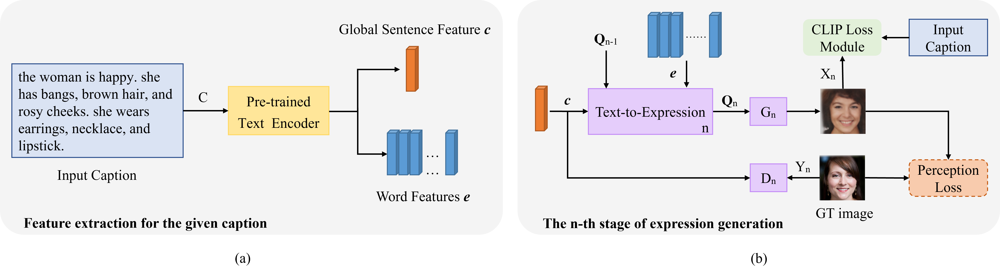

# FaceCLIP 
Pytorch implementation for Facial Expression Genaration from Text with CLIP. The goal is to generate realistic facial expression images from pure text, and also allow the user to sematiclly edit basic facial attributes using natural language descriptions to present complex attribute combinations, in one framework. 

### Overview


**[Facial Expression Genaration from Text with FaceCLIP].**  


### Data

1. Download the original data for [AffectNet](http://mohammadmahoor.com/affectnet/) and [RAF-DB](http://www.whdeng.cn/raf/model1.html), and save both into `data/`. Based on the two datasets, we built a new Facial Expressions and Texts (FET) dataset.
2. Preprocess the facial images from [AffectNet] dataset and save the images to `data/affectnet/image/`
3. Preprocess the facial images from [RAF-DB] dataset and save the images to `data/affectnet/image/`
   ```
    python crop_alignface/align_images.py  //crop and align facial expression images
    ```
4. Based on the annotated attribute excel data/affectnet/affect_attributes.xlsx, we generated 10 different texts per image. Download these texts from the [link](https://pan.baidu.com/s/1PsxyCYZNhWv89VGbZtLZfg?pwd=face), and save them into `data/affectnet/text/`.
   ```
    python PCFG/Inside-Outside-Algorithm/train.py  //generate 10 different texts for each image in FET dataset
    ``` 

### Training
All code was developed and tested on Linux with Python 3.7 (Anaconda) and torch '1.10.1+cu111'.

#### [DAMSM](https://github.com/taoxugit/AttnGAN) model includes text encoder and image encoder
- Pre-train DAMSM model for the FET dataset:
```
python pretrain_DAMSM.py --cfg cfg/DAMSM/.yml --gpu 0
```

#### FaceCLIP model 
- Train FaceCLIP model for the FET dataset:
```
python main.py --cfg cfg/train_affectnet.yml --gpu 1
```

`*.yml` files include configuration for training and testing.


#### Pretrained DAMSM Model
- [DAMSM for affectnet](https://pan.baidu.com/s/1E2qtCxeD42Pro7_g8PlbYw?pwd=face). Download and save it to `DAMSMencoders/`
#### Pretrained FaceCLIP Model
- [FaceCLIP for affectnet](https://pan.baidu.com/s/1b6_SEomQs2joISZ9qy5F_Q?pwd=face). Download and save it to `models/` or `output/'
(You may need to modify the path in the .yaml file to suit your situation)
### Testing
- Test ControlGAN model for FET dataset:
```
python main.py --cfg cfg/eval_affectnet.yml --gpu 2
```

### Evaluation

- To generate and save 30,000 images for all captions in the testing dataset, change B_VALIDATION to `True` in the eval_*.yml. 
- FID for the collected FET dataset: [Frechet Inception Distance](https://github.com/bioinf-jku/TTUR).
- LIPIS for the collected FET dataset: [PerceptualSimilarity](https://github.com/richzhang/PerceptualSimilarity).
- R-precision is embedded in the testing process, i.e. when B_VALIDATION is `True`, the value of R-precision is calculated and output after 30,000 images have been generated.


